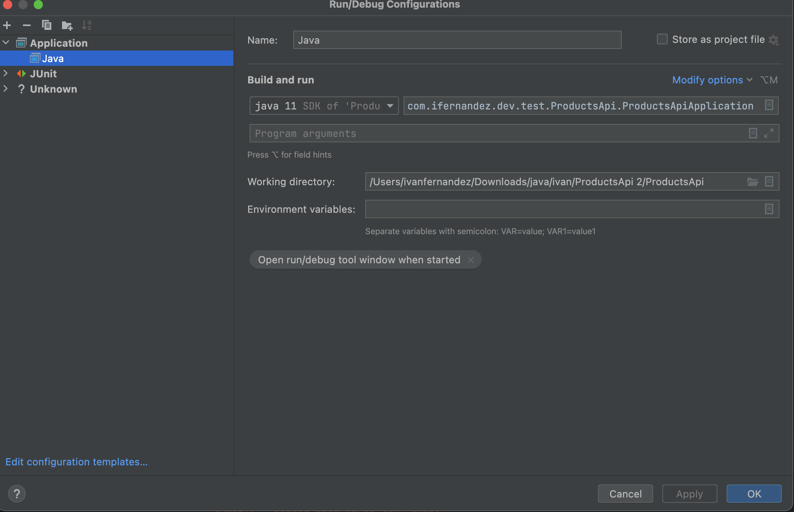
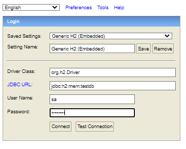
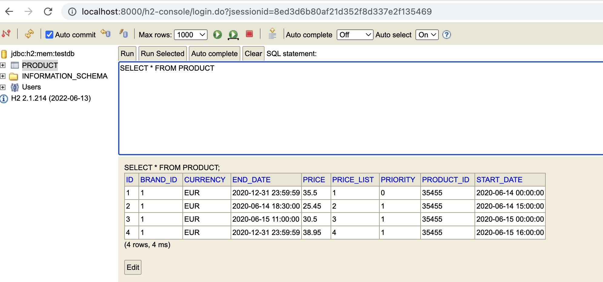
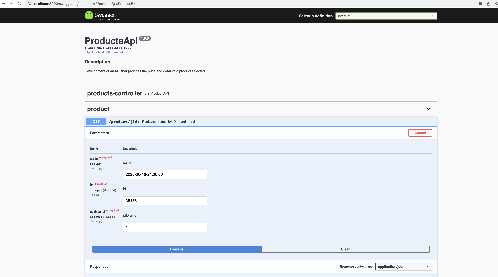
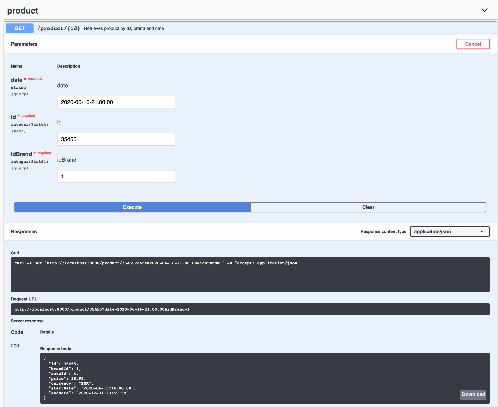
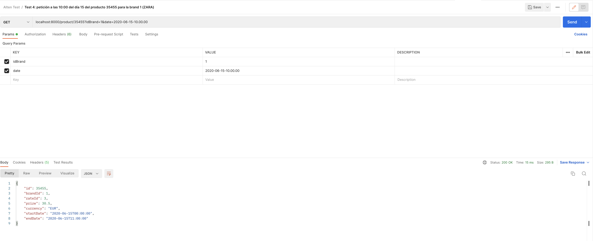
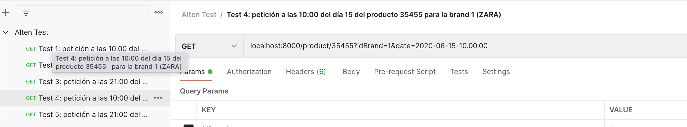

# Prueba técnica Alten Ivan Fernandez

Se desarrolla la solución indicada haciendo uso de una aplicación Java + SpringBoot y utilizando Maven.
Para almacenar los productos se ha utilizado una base de datos en memoria h2, en la que se cargan los productos una vez arranca la aplicación, ya que el set de productos según lo indicado en la documentación iba a ser siempre el mismo para este prototipo.

Para ejecutar la aplicación se ha utilizao el IDE IntelliJ y a través de maven con un apache tomcat que incluye el propio proyecto springboot.

Para ver la base de datos y poder lanzar consultas se puede administrar desde la siguiente url cuando la aplicación esté en ejecución:

 [http://localhost:5000/h2-console](http://localhost:5000/h2-console)

 Las credenciales para entrar son:
 - Username: sa
 - Password: password

 

 A continuación se pueden ver los datos de la tabla de productos:

  

El endpoint que se ha expuesto recoge por parámetro el identificador el producto, identificador de la marca y una fecha de aplicacion. En la direccion 
http://localhost:8000/swagger-ui/index.html ya que está puesto el puerto 8000 en el server se muestra la especificacion swagger. Desde ahi se pueden realizar las pruebas:

El resultado es un modelo Producto con su identificador, marca, tarifa, precio, moneda y las fechas de inicio y fin de esa tarifa:

Tambien se proporciona colección postman para los test solicitados en la prueba: 

